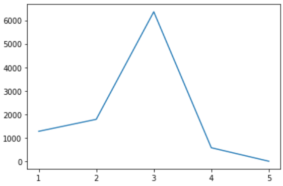

> 숭실대학교
>
> 확률과 통계
>
> 중간고사 대체 프로젝트(마피아게임)
>
> 강병휘
>
> 2021-11-23

개요

> 1.기본적인 마피아 게임
>
> 2.경찰이 추가된 마피아 게임
>
> 3.의사가 추가된 마피아 게임
>
> 4.실험
>
> 5.결론
>
> 1.기본적인 마피아 게임

기본적인 마피아 게임에서, 먼저 가정해야 할 것이 있습니다.

마피아게임에서 중요한 요소인 정치적 요소를 배제한 순수 확률로써 투표가
이루어집니다.

또한 밤에는 무조건 시민만 죽습니다.

마피아가 1명일 때, X축은 시민의 수, Y축은 시민의 승률입니다. (10000번의
게임 진행)

{width="3.8333333333333335in"
height="2.5930555555555554in"}

0.3303 0.25 0.4626 0.3841 0.5384 0.4442 0.5983 0.5064

놀랍게도, 시민의 숫자가 단순히 많다고 해서 시민측의 승률이 높지
않습니다.

답은 마피아 게임의 승리 조건에 있습니다.

마피아게임에서 마피아가 승리하기 위해서는 시민의 숫자와 마피아의 숫자가
같아져야 합니다.

시민이 2명이고 마피아가 1명일 때 낮의 투표를 통해 게임의 승패가
정해집니다.

투표로 인해 마피아가 사망하거나, 시민이 사망하면 그 즉시 게임이 종료되고
마피아가 살아남았

다면 마피아의 승리, 아니라면 시민의 승리입니다. 이때 낮의 투표를 통해
마피아가 죽을 확률은

1/3 즉 0.3333이고 이는 시민측의 승률입니다.

하지만 시민이 3명이고 마피아가 1명일 때 승률은 왜 시민이 2명일 때 보다
낮을까요?

먼저 투표를 진행했을 때 마피아가 죽을 확률은 1/4입니다. 만약
살아남았다면 확정적으로 시민

이 사망합니다. 이때 시민 1명, 마피아 1명이 남았기 때문에 마피아가
승리하게 됩니다.

즉, 낮의 투표를 통해 마피아가 죽을 확률이 낮아졌기 때문에, 마피아가
승리할 확률이 올라가게

됩니다.

이처럼 시민이 4명일때의 시민의 승률은 5명일때보다 높습니다. 이는 시민의
수가 상승해도 항상

수렴합니다. 즉, 2n의 승률은 2n+1의 승률보다 높다는 것을 알 수 있습니다.

2n보다 시민이 한명 더 많을 때(2n+1), 낮에 마피아가 지목당해 사망할
확률은 2n보다 낮습니다.

1/2n \< 1/(2n+1), 이때 마피아가 살아남았다면, 밤에는 확정적으로 시민
한명이 사망하기 때문에

시민의 수가 2n일때가 2n+1일때보다 승률이 높습니다.

![]image/media/image2.png){width="1.7486111111111111in"
height="1.9722222222222223in"}

![]image/media/image3.png){width="1.9694444444444446in"
height="0.41805555555555557in"}

> (점화식)

n이 3보다 클 때, n명의 시민과 1명의 마피아의 마피아 게임은 위 식으로
계산할 수 있습니다.

시민의 승률을 계산해 보았을 때, 2n보다 2n+2은 항상 승률이 높고,

2n+1보다 2n+3보다 항상 높습니다. 즉, 시민의 승률은 홀수일 때와 짝수일 때
각각 비례하며 상

승합니다.

마피아가 2명일 때, X축은 시민의 수, Y축은 시민의 승률입니다.

![]image/media/image4.png){width="3.6805555555555554in"
height="2.4430544619422574in"}

0.1378 0.0827 0.2275 0.1613 0.2972 0.2152 0.358 0.2687

마피아가 2명일때도 마찬가지로 시민의 승률은 홀수일 때와 짝수일 때 각각
비례하며 상승합니다.

> 2.경찰이 있는 마피아 게임

먼저 경찰은 게임에서 단 한명만 있다고 가정하여 코드를 짰습니다.

또한 똑똑한 경찰의 경우 매일 밤마다 자신을 제외한 나머지 인원을
탐색합니다.

만약 탐색한 사람이 마피아라면 다음 탐색에서는 그 사람을 제외하고 탐색을
진행합니다.

즉, 게임의 마피아를 모두 기억하면서 탐색합니다.

그 뒤, 매일 낮에 군중들을 설득합니다. 이때 경찰의 설득능력이 파라미터로
존재합니다.

예를 들어, 경찰이 1/2의 확률로 군중을 설득한다면, 자신이 밤에 탐색했던
마피아를 죽일 수 있

게 됩니다. 반대로 실패한다면, 무작위 인물이 투표로 사망합니다.

이때, 경찰이 있는 마피아게임의 시민 승률은 다음과 같습니다.

마피아수 1, 경찰의 설득확률 1/2, X축은 시민 + 경찰의 수

![]image/media/image5.png){width="2.422222222222222in"
height="1.6027777777777779in"}

0.2546 0.508 0.4166 0.5873 0.5203 0.6501 0.5685 0.6936

반대로 경찰이 멍청한 경우 경찰은 자신이 확인한 사람을 당일만 기억하고
있을 때에는 다음과

같습니다.

![]image/media/image6.png){width="2.6222222222222222in"
height="1.7638888888888888in"}

0.2512 0.4968 0.4165 0.5892 0.5062 0.6466 0.5747 0.6903

결과값이 크게 달라지지 않았습니다. 이유는 설득능력과 마피아의 수에
상관관계가 있습니다.

우선 마피아가 단 한명이기 때문에 경찰이 기억력이 좋은 것과 나쁜 것에
크게 영향을 끼치지 못

했습니다. 또한 설득능력이 높기 때문에 탐색된 마피아가 죽을 확률이 무려
절반이나 됩니다.

그렇다면 똑똑한 경찰이 있고, 마피아가 세명일 때, 멍청한 경찰이 있고
마피아가 세명일 때를 각

각 비교해보겠습니다. 그리고 설득확률을 0.3으로 설정하여
비교해보겠습니다.

경찰이 멍청한 경우 (x축은 시민과 경찰의 합입니다.)

![]image/media/image7.png){width="3.4680555555555554in"
height="2.3208333333333333in"}

0.191 0.3056 0.2313 0.3505 0.2565 0.3723 0.3081 0.4079

경찰이 똑똑한 경우

![]image/media/image8.png){width="3.5652777777777778in"
height="2.3958333333333335in"}

0.2 0.319 0.2393 0.3565 0.271 0.3877 0.305 0.4188

차이가 크긴 않지만, 똑똑한 경찰의 경우 승률이 더 높게 나타나는 것을 알
수 있습니다.

이때 설득확률을 0.5로 다시 바꾸어서 비교하겠습니다.

경찰이 멍청한 경우 (x축은 시민과 경찰의 합입니다.)

0.2181 0.3313 0.2561 0.3691 0.2922 0.4124 0.3309 0.4331

![]image/media/image9.png){width="3.238888888888889in"
height="2.1597222222222223in"}

경찰이 똑똑한 경우

0.2265 0.3462 0.2689 0.3862 0.3103 0.4297 0.3427 0.4523

![]image/media/image10.png){width="3.363888888888889in"
height="2.2930555555555556in"}

경찰의 설득능력이 높을수록 시민측의 승률이 더 높게 나타나는 것을 알 수
있습니다.

경찰이 자신이 탐색한 마피아를 전부 기억할 때가 하루가 지나면 탐색한
마피아를 잊을때보다 승

률이 높고, 경찰이 군중을 설득할 확률이 높을수록 시민측이 승리할 확률이
높습니다.

즉 경찰의 능력이 효과적으로 발현되려면, 어느정도 게임의 인원이 많이
존재할 때 더 효과적이

라고 볼 수 있습니다.

> 3.의사가 추가된 마피아 게임

먼저 의사는 게임에서 한명이라고 가정합니다.

의사는 매일 밤마다 전체중의 한명을 지목하고 그사람이 마피아에게 지목된
사람이라면 밤에 아

무도 죽지 않도록 코드를 짰습니다.

의사가 있는 마피아게임과 의사가 없는 마피아 게임에서 승률의 차이는
다음과 같습니다.

의사가 없을 때

![]image/media/image11.png){width="4.065277777777778in"
height="2.7069444444444444in"}

0.2444 0.4759 0.3727 0.543 0.4576 0.595 0.5102 0.6269

의사가 있을 때

![]image/media/image12.png){width="3.875in"
height="2.6124989063867017in"}

0.2785 0.4626 0.4116 0.5373 0.4731 0.5954 0.5301 0.6322

의사가 있을 때가 의사가 없을 때보다 승률이 높게 관측됩니다. 의사가 가진
능력이 발동될 때마

다, 한번의 낮투표가 더 진행될 수 있고, 이는 마피아가 죽을 확률을
높여줍니다. 이 때문에 의사

의 있을 때, 유의미한 승률상승을 확인할 수 있습니다.

![]image/media/image13.png){width="3.6652766841644793in"
height="3.188888888888889in"}

이처럼 기존의 시민만 있는 게임에서 의사가 추가된다면 기존의 확률 +
(매일마다 투표에서 시민

이 죽을 확률 \* 1/전체 생존인원 \* 1/마피아를 제외한 생존인원 \* 다음
투표에서 마피아가 죽을

확률) 의 값이 더해져 시민측의 승률을 상승시킵니다.

신기한 점은 시민의 수가 짝수일 때에는 승률이 홀수일 때보다 크게 상승하지
않았습니다.

![]image/media/image14.png){width="3.5555555555555554in"
height="3.966666666666667in"}

이처럼 의사가 추가된다고 해도, 기존확률에 비해 승률의 상승폭이 홀수일
때보다 작기 때문에,

값에 차이가 크지 않습니다.

짝수일때의 승률이 크게 차이가 나지 않더라도, 결론적으로 의사가 추가된
마피아 게임에서 시민

측의 승률은 기본적인 마피아 게임에서보다 더 높습니다. 이는 의사는 시민의
승률을 상승시킨다

고 볼 수 있습니다.

> 4.개인적인 실험
>
> a.이기적인 의사와 이타적인 의사의 승률

확률적으로 계산되는 마피아 게임에서, 의사가 자기 자신에게만 능력을
사용할 때와, 그렇지 않을

때의 승률은 크게 차이가 날까에 대한 분석을 해보았습니다.

이기적인 의사의 경우

![]image/media/image15.png){width="3.4499989063867016in"
height="2.338888888888889in"}

0.5453 0.5274 0.5799 0.5656 0.6315 0.6112 0.6456 0.6233

이타적인 의사의 경우

![]image/media/image16.png){width="3.725in"
height="2.504166666666667in"}

0.5336 0.4752 0.5894 0.5168 0.6314 0.5725 0.6618 0.5969

이기적인 의사의 경우가 이타적인(무작위 한명을 선택)의사보다 더 승률이
높은 것을 알 수 있습

니다. 이러한 결과가 나오는 중요한 이유는 밤에 의사가 마피아가 지목한
사람을 지목할 확률에

있습니다.

이기적인 의사의 경우 (1/의사의 수) \*(1/마피아를 제외한 생존인원)입니다.

이타적인 의사의 경우 (1/전체 생존인원) \* (1/마피아를 제외한
생존인원)입니다.

시민이 4명, 의사가 1명, 마피아가 1명이라고 가정했을 때 위의 확률은 1/1
\* 1/5 = 1/5

아래의 확률은 1/6 \* 1/5 = 1/30 입니다. 위의 확률이 더 높습니다. 즉
의사가 마피아를 살려주는

잘못된 선택을 하지 않게 되고, 확정적으로 시민측 인원을 살리기 때문에 낮
투표로 인해 마피아

가 투표로 사망하게 되는 경우가 생기게 됩니다. 즉 이기적이라고 생각했던
행동이 집단의 승리

를 가져다 줄 수 있게 됩니다. 개인의 이기심으로 개인의 이익만을 추구할 때
사회의 이익을 증

진시킬 수 있는 마치 애덤 스미스의 보이지 않는 손의 결과가 나왔습니다.

> b.의사와 경찰이 모두 있는 게임

위의 내용을 살펴보면, 의사와 경찰은 모두 마피아 게임에서 시민의 승률을
상승시키는 요소입니

다.

x축은 시민측 총 인원, 마피아 수 1 y축은 시민의 승률

{width="3.3874989063867016in"
height="2.233332239720035in"}

위의 그래프는 시민만 있는 마피아게임과 의사1,경찰1이 포함된 마피아
게임의 시민승률 비교입

니다.

의사와 경찰이 생김으로써 시민의 승률은 상승하는 것을 알 수 있습니다.
이는 위에서 설명한 경

찰이 시민의 승률을 높이는 요인, 의사가 시민의 승률을 높이는 요인이
복합적으로 작용하여 이

루어진 결과입니다.

마피아게임에서 게임 진행일수는 게임의 중요한 지표입니다. 게임의 최소
진행일 수는 마피아의

수 m이며, 최대 진행 일수는 시민측 n명, 마피아측 m일 때 n+m-1일입니다.
진행일이 어떤 분포

를 갖고 있을지 표를 그려보았습니다.

{width="2.765277777777778in"
height="1.8166666666666667in"}

\[1275, 1785, 6363, 576, 1\]

> {width="2.763888888888889in"
> height="1.7597222222222222in"}

왼쪽은 시민 5, 경찰 1, 의사 1, 마피아 1로 10000번 돌렸을 때 게임
종료일의 분포입니다.

오른쪽에서 파란색그래프는 시민의 승리 종료일, 노란색그래프는 마피아의
승리 종료일입니다.

{width="2.848611111111111in"
height="1.8277777777777777in"}

> {width="2.7708333333333335in"
> height="1.7652777777777777in"}

\[153, 430, 742, 3041, 5156, 476, 2\]

시민 10, 경찰 1, 의사 1, 마피아 2로 10000번 돌렸을 때 게임 종료일의
분포입니다.

위와 마찬가지로 오른쪽 그래프는 각 진영의 승리시의 종료일입니다.

{width="2.948611111111111in"
height="1.831943350831146in"}

> {width="2.848611111111111in"
> height="1.795832239720035in"}

시민 15, 경찰 1, 의사 1, 마피아 3로 1000000번 돌렸을 때 게임 종료일의
분포입니다.

위와 마찬가지로 오른쪽 그래프는 각 진영의 승리시의 종료일입니다.

이 지표로 알 수 있는 점은 시민은 승리가 고르게 분포되어 있는 반면,
마피아는 특정일과 그 사

이에 집중적으로 분포되어 있습니다. 마피아의 승리조건이 시민과 마피아의
인원이 동률일 때이

기 때문에 그렇습니다.

의사와 경찰이 게임에서 단 한 명씩만 존재한다고 했을 때, 시민과 마피아의
비율을 5:1로 설정한

다면 대략적으로 시민+경찰+의사/2 즈음에서 게임이 종료될 확률이 가장
높습니다.

이를 알고 마피아게임을 시작한다면, 다음에 친구들과 마피아게임을 진행할
때, 종료일 수를 예측

하고 적절한 인원을 분배할 수 있을 것입니다.

> 5.결론

결론적으로 마피아 게임은 다음과 같이 정리할 수 있습니다.

시민만 존재하는 마피아게임에서, 시민의 n이 높아질수록 n-2보다
마피아게임에서 시민의 승률은

높습니다. 반대로 마피아의 수 m이 증가할수록 시민의 승률은 낮아집니다.

시민의 수가 증가할수록 마피아게임의 진행일수가 증가하고, 그에 따라
마피아가 죽을 확률 또한

상승합니다.

경찰과 시민이 있는 마피아 게임에서, 경찰은 마피아를 탐색하고 탐색한
마피아를 단두대에 올려

야 합니다. 이때, 경찰의 탐색능력은 경찰을 제외한 값으로 상수이며, 경찰의
설득력은 값을 지정

하거나 난수로 사용할 수도 있습니다. 이때, 경찰의 설득력이 낮다면, 경찰이
마피아를 탐색했다

고 해도 낮 투표에 영향을 줄 가능성이 적습니다. 또한 경찰은 자신이 탐색한
마피아를 항상 기

억하고 있어야만 낮 투표에 영향을 줄 수 있습니다. 경찰의 설득력과
기억력이 뛰어나다면 경찰

은 시민의 승률을 높일 수 있는 역할이지만, 반대로 설득력과 기억력이 좋지
않다면 승률에 큰

영향을 끼칠 수 없습니다.

의사와 시민이 있는 마피아 게임에서, 의사는 확률적으로 매우 낮지만 밤에
마피아가 지목한 인

물과 동일한 인물을 지목한다면 아무도 죽지 않는 밤을 만들 수 있습니다.
확정적으로 시민의 사

망을 막을 수 있는 의사의 존재는 시민의 승률을 크게 상승시키는 존재라고
볼 수 있습니다.

또한 이기적인 의사와 이타적인 의사는 공통적으로 시민의 승률을
상승시킵니다. 하지만 확률적

으로는 이기적인 의사는 마피아에게 능력을 사용하는 불상사를 없앨 수 있기
때문에 이타적인 의

사보다 승률상승폭이 더 큽니다.

경찰과 의사 시민이 있는 마피아 게임에서, 위에서 만들었던 경찰과 의사가
함께 게임에 참가한

다면, 시민의 승률은 더욱 상승합니다. 경찰로 인해 마피아의 신분을 들키고,
밤에 지목한 사람을

의사가 살릴 수 있기 때문입니다. 상대적으로 복잡한 의사와 경찰이 모두
포함된 마피아 게임에

서, 의사와 경찰이 1명씩만 있다면, day = (시민+2)/2 일 때, day만큼의
진행일정도에서 게임이 종

료될 가능성이 높습니다.
